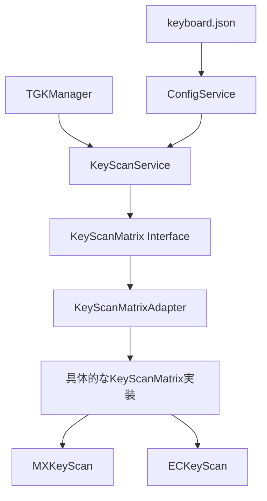
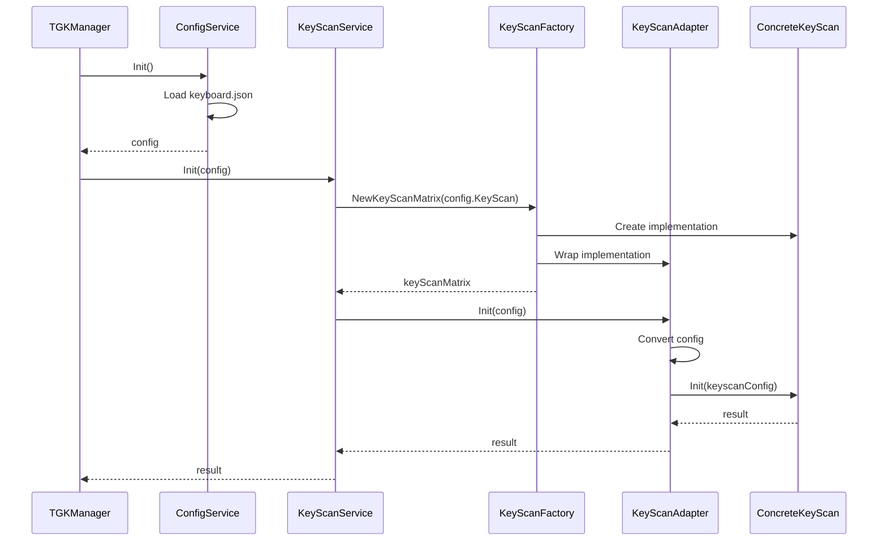

# Design Document

## Overview

このドキュメントでは、TGKプロジェクトにおけるキースキャンパッケージの動的読み込み機能の設計について詳細に説明します。現在の実装では、keyboard.jsonファイルで指定されたキースキャンタイプに基づいて適切なキースキャンマトリックスの実装を選択していますが、型の不一致やインターフェースの互換性の問題があります。この設計では、これらの問題を解決し、より柔軟で拡張性のある実装を提案します。

## Architecture

キースキャンパッケージの動的読み込み機能は、以下のアーキテクチャに基づいて設計されます：

1. **レイヤー構造**：
   - tgkパッケージ：メインのアプリケーションロジックとインターフェース定義
   - keyscanパッケージ：具体的なキースキャンマトリックスの実装

2. **インターフェース設計**：
   - tgkパッケージでKeyScanMatrixインターフェースを定義
   - keyscanパッケージでは、このインターフェースを実装する具体的なクラスを提供

3. **ファクトリーパターン**：
   - キースキャンタイプに基づいて適切な実装を選択するファクトリー関数
   - 拡張性を考慮した設計

4. **設定管理**：
   - keyboard.jsonファイルからの設定読み込み
   - 設定データの適切な変換と検証

## Components and Interfaces

### 1. KeyScanMatrix インターフェース

```go
// tgk/types.go
package tgk

type KeyScanMatrix interface {
    // Init はキースキャンマトリックスを初期化します
    Init(config KeyboardConfig) error
    // Scan はマトリクススキャン関数です
    Scan() bool
    // GetNowPushing は現在押されているキーの状態を返します
    GetNowPushing() [][]bool
    // GetNowRelease は現在離されているキーの状態を返します
    GetNowRelease() [][]bool
    // Print は現在の状態を文字列で出力します
    Print() string
}
```

### 2. KeyScanMatrixAdapter

型の不一致を解決するためのアダプターパターンを導入します：

```go
// keyscan/adapter.go
package keyscan

import "github.com/tgk-project/tgk"

// KeyScanMatrixAdapter はkeyscan.KeyScanMatrixをtgk.KeyScanMatrixに変換するアダプターです
type KeyScanMatrixAdapter struct {
    impl KeyScanMatrix
}

// NewKeyScanMatrixAdapter は新しいKeyScanMatrixAdapterを作成します
func NewKeyScanMatrixAdapter(impl KeyScanMatrix) tgk.KeyScanMatrix {
    return &KeyScanMatrixAdapter{impl: impl}
}

// Init はキースキャンマトリックスを初期化します
func (a *KeyScanMatrixAdapter) Init(config tgk.KeyboardConfig) error {
    // tgk.KeyboardConfigをkeyscan.KeyboardConfigに変換
    keyscanConfig := convertConfig(config)
    return a.impl.Init(keyscanConfig)
}

// その他のメソッド実装...

// convertConfig はtgk.KeyboardConfigをkeyscan.KeyboardConfigに変換します
func convertConfig(config tgk.KeyboardConfig) KeyboardConfig {
    // 変換ロジック
    return KeyboardConfig{
        // フィールドのマッピング
    }
}
```

### 3. 拡張可能なファクトリー

```go
// keyscan/factory.go
package keyscan

import "github.com/tgk-project/tgk"

// KeyScanMatrixFactory はキースキャンマトリックスのファクトリー関数の型です
type KeyScanMatrixFactory func() KeyScanMatrix

// registeredFactories は登録されたファクトリー関数のマップです
var registeredFactories = map[string]KeyScanMatrixFactory{
    "mx": NewMXKeyScan,
    "ec": NewECKeyScan,
}

// RegisterKeyScanMatrix は新しいキースキャンマトリックスタイプを登録します
func RegisterKeyScanMatrix(typeName string, factory KeyScanMatrixFactory) {
    registeredFactories[typeName] = factory
}

// NewKeyScanMatrix はキースキャンタイプに基づいて適切なKeyScanMatrixを作成します
func NewKeyScanMatrix(keyscanType string) tgk.KeyScanMatrix {
    factory, exists := registeredFactories[keyscanType]
    if !exists {
        // デフォルトはMX
        factory = NewMXKeyScan
    }
    
    impl := factory()
    return NewKeyScanMatrixAdapter(impl)
}
```

### 4. KeyScanService の改善

```go
// tgk/service_keyscan.go
package tgk

import "github.com/tgk-project/tgk/keyscan"

// KeyScanService はキースキャンサービスのインターフェースです
type KeyScanService interface {
    // Init はキースキャンサービスを初期化します
    Init(config KeyboardConfig) error
    // Scan はキーマトリックスをスキャンし、押されているキーの情報を返します
    Scan() bool
    // Print は現在の状態を文字列で出力します
    Print() string
}

type keyScanService struct {
    keyScan    KeyScanMatrix
    nowPushing [][]bool
    nowRelease [][]bool
}

func NewKeyScanService() KeyScanService {
    return &keyScanService{}
}

func (s *keyScanService) Init(config KeyboardConfig) error {
    // configからkeyscanタイプを取得して適切なKeyScanMatrixを作成
    s.keyScan = keyscan.NewKeyScanMatrix(config.KeyScan)
    
    // 直接tgk.KeyboardConfigを渡せるようになった
    return s.keyScan.Init(config)
}

// その他のメソッド実装...
```

## Data Models

### KeyboardConfig

keyboard.jsonファイルから読み込まれる設定データの構造を定義します：

```go
// tgk/types.go
type KeyboardConfig struct {
    Name                string              `json:"name"`
    Maintainer          string              `json:"maintainer"`
    VendorID            string              `json:"vendorId"`
    ProductID           string              `json:"productId"`
    KeyScan             string              `json:"keyscan"`
    Matrix              Matrix              `json:"matrix"`
    KeyScanExtraConfigs KeyScanExtraConfigs `json:"keyscan_extra_configs"`
    HID                 []string            `json:"hid"`
    Split               bool                `json:"split"`
    MatrixPins          MatrixPins          `json:"matrix_pins"`
    Layouts             Layouts             `json:"layouts"`
    LogLevel            string              `json:"log_level,omitempty"`
}
```

### KeyScanConfig

キースキャンマトリックスの設定データを定義します：

```go
// keyscan/types.go
type KeyScanConfig struct {
    Type            string   // キースキャンタイプ（"mx", "ec"など）
    RowPins         []string // 行ピンの名前
    ColPins         []string // 列ピンの名前
    DiodeDirection  string   // ダイオード方向（"col2row", "row2col"）
    PushThreshold   int      // 押下閾値（ECキースキャン用）
    ReleaseThreshold int     // 解放閾値（ECキースキャン用）
    ADCGain         int      // ADCゲイン（ECキースキャン用）
    ColChannel      []string // 列チャンネル（ECキースキャン用）
}
```

## Error Handling

エラー処理の戦略を定義します：

1. **初期化エラー**：
   - 設定ファイルの読み込みエラー
   - 未知のキースキャンタイプ
   - ピン設定の不足

2. **実行時エラー**：
   - ハードウェア操作エラー
   - スキャン中のエラー

エラーメッセージは明確で、問題の原因と可能な解決策を示すものにします。

```go
// エラー定義の例
var (
    ErrUnknownKeyScanType = errors.New("unknown keyscan type")
    ErrInvalidPinConfig   = errors.New("invalid pin configuration")
    ErrInitFailed         = errors.New("keyscan initialization failed")
)
```

## Testing Strategy

テスト戦略を定義します：

1. **ユニットテスト**：
   - 各キースキャンマトリックス実装のテスト
   - アダプターのテスト
   - ファクトリー関数のテスト

2. **統合テスト**：
   - KeyScanServiceとKeyScanMatrixの統合テスト
   - 設定ファイルからの読み込みテスト

3. **モックとスタブ**：
   - ハードウェア依存部分のモック
   - 設定ファイルのスタブ

```go
// テスト例
func TestKeyScanMatrixFactory(t *testing.T) {
    // MXタイプのテスト
    mxMatrix := keyscan.NewKeyScanMatrix("mx")
    if _, ok := mxMatrix.(*keyscan.KeyScanMatrixAdapter); !ok {
        t.Error("Expected KeyScanMatrixAdapter for mx type")
    }
    
    // ECタイプのテスト
    ecMatrix := keyscan.NewKeyScanMatrix("ec")
    if _, ok := ecMatrix.(*keyscan.KeyScanMatrixAdapter); !ok {
        t.Error("Expected KeyScanMatrixAdapter for ec type")
    }
    
    // 未知のタイプのテスト
    unknownMatrix := keyscan.NewKeyScanMatrix("unknown")
    if _, ok := unknownMatrix.(*keyscan.KeyScanMatrixAdapter); !ok {
        t.Error("Expected KeyScanMatrixAdapter with default implementation for unknown type")
    }
}
```

## Diagrams

### コンポーネント図



### シーケンス図



## Implementation Considerations

1. **TinyGoの制約**：
   - リフレクションの制限
   - メモリ使用量の最適化
   - コンパイル時の最適化

2. **パフォーマンス**：
   - キースキャンの頻度と応答性
   - メモリ使用量

3. **拡張性**：
   - 新しいキースキャンタイプの追加方法
   - 設定オプションの拡張

4. **互換性**：
   - 既存のコードとの互換性
   - 将来の拡張に対する柔軟性