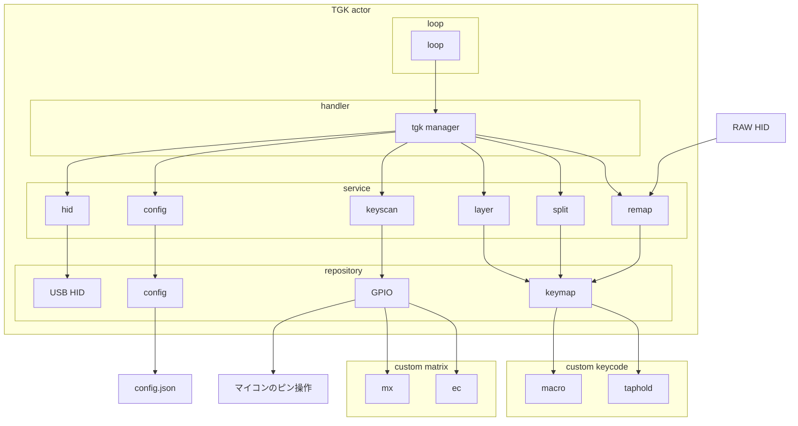

# TGK

TGK is a tinygo Keyboard Firmware Supported by tinygo for nrf52xxx .

## アーキテクチャ図

## TODO

- [ ] hid パッケージに用意されている関数を動的に読み込んで HIDService を構築させる
- [ ] matrix パッケージに用意されている関数を動的に読み込んで keyscan を動的に実行する
- [ ] ユーザ指定の keyscan を config リポジトリに配置して実行できるようにする
