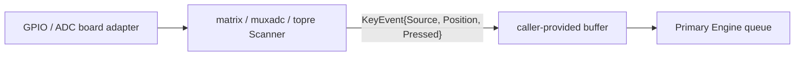

# Issue #1: Scanner abstraction and hardware adapters

## 目的と完了状態

- Issue: [#1 Scanner abstraction and hardware adapters](https://github.com/tgk-project/tgk/issues/1)
- 完了した範囲: `KeyEvent` を発行する Matrix、MUX/ADC、Topre scanner と、共通の time-based debounce を追加した。すべて caller-provided buffer を使い、keycode を生成しない。Seeed Studio XIAO BLE 向け Matrix GPIO adapter と TinyGo build probe も追加した。
- reference board: Seeed Studio XIAO BLE（nRF52840）。XIAO nRF52840 Plus は同じ MCU 系だが、検証時の TinyGo 0.39.0 に `xiao-ble-plus` target がなく、専用 pin/flash 定義を推測して流用しないため採用しなかった。
- 未検証: XIAO BLE 実機での GPIO 電圧、matrix wiring、実際の Position event。TinyGo build は成功したが HIL ではない。
- 対象外: keymap 解決、Split BLE transport、keyboard 固有の配線設定。`old/` 配下の実装は参照していない。

## 設計と実装

`keyboard/event.Scanner`（#8 で定義済み）の `Scan(now, dst)` を全 scanner の共通境界とした。`dst` は呼出側が所有し、scanner は `dst[:0]` に append して返す。容量を超える場合は transition を commit せず error を返すため、次回の Scan で event を再試行できる。

| パッケージ | 実装した責務 |
| --- | --- |
| `scanner/debounce` | debounce candidate と安定状態を保持する allocation-free state。event を buffer へ書けた時だけ stable state を commit する。 |
| `scanner/matrix` | `OutputPin` / `InputPin` adapter 経由で digital matrix を走査する。row-major または明示 `Positions` mapping を使う。 |
| `scanner/muxadc` | `Multiplexer` / `RowDriver` / `ADC` adapter 経由で行列状の analogue sensor を走査する。press/release threshold による hysteresis を持つ。 |
| `scanner/topre` | `Reader` adapter 経由で Topre-style sensor を走査する。sensor index は `Positions` で物理 Position へ変換する。 |
| `platform/xiao_ble` | `machine.Pin` を `matrix.OutputPin` / `matrix.InputPin` へ変換する、XIAO BLE 専用 adapter。 |
| `cmd/xiao-ble-scanner` | D0 row・D1 column の最小 1x1 build probe。keyboard 固有配線ではなく target build を検証するためのもの。 |

各 scanner は `Source` と `Position`、`Pressed`、`Timestamp` だけを `event.KeyEvent` に入れる。Binding、keycode、layer、modifier、Host report は `keyboard/engine` に残るため、Primary-only state ownership と Position-to-keycode separation を維持する。

`matrix` は行を active にして列を読むための抽象 GPIO interface だけを知る。`muxadc` と `topre` は press threshold と release threshold を分け、threshold 間の値では直前の debounced state を維持する。すべての pin/ADC/board wiring は adapter の実装側に閉じ込め、scanner package と keyboard core は `machine` を import しない。

## 判断理由

- hardware package を直接 import すると通常 Go test と新しいボードへの移植が難しくなるため、最小の GPIO/ADC interface を scanner 側の境界にした。
- buffer が満杯のときに debounced state だけ進めると press/release の対応が失われるため、event を append できた場合だけ `debounce.State.Commit` を呼ぶ。
- analogue scanner は単一 threshold では電圧揺れで連続 transition を起こし得るため、press/release の 2 threshold と debounce を両方適用した。
- `Source` は scanner config で固定し、同一 Position 番号を使う複数の物理 input が Engine で区別できるようにした。
- XIAO nRF52840 Plus は将来の候補として残した。ただし、TinyGo に正式 target がない段階では、通常 XIAO BLE 用の pin mapping を Plus へ互換と仮定しない。

## 検証

以下は `mise` で固定した Go `1.27.0` による Host-side 検証である。GPIO、ADC、reference board、TinyGo firmware の実機検証ではない。

| コマンド | 結果 |
| --- | --- |
| `mise exec go -- go test ./...` | 成功。#8 の fake scanner 経由の core 消費テストと、各 scanner の host-side test を実行した。 |
| `mise exec go -- go test -run 'Test(MatrixDebounceAndPositionMapping|MUXADCDebounceHysteresisAndPositionMapping|TopreDebounceHysteresisAndPositionMapping)$' ./scanner/... -count=1` | 成功。3 scanner の debounce/hysteresis と Position mapping を再確認した。 |
| `mise exec go -- go test ./scanner/matrix -count=1` | 成功。buffer が満杯でも transition を次回 scan に保持すること、および Matrix の event path が allocation 0 であることを確認した。 |
| `mise exec go -- go test -race ./...` | 成功。Host-side race 検査。 |
| `mise exec go -- go vet ./...` | 成功。 |
| `mise exec go@1.25 -- tinygo build -target=xiao-ble -o /private/tmp/tgk-xiao-ble-scanner.uf2 ./cmd/xiao-ble-scanner` | 成功。TinyGo 0.39.0 の `xiao-ble` target で 18 KB の UF2 を生成した（build-only）。 |

## 制約と次の依存関係

- XIAO BLE adapter は Matrix のみである。MUX/ADC または Topre を XIAO BLE に接続する場合は、その実配線に応じた `Multiplexer` / `RowDriver` / `ADC` または `Reader` adapter が別途必要になる。
- D0/D1 の 1x1 build probe は board target の検証用であり、reference keyboard の配線定義ではない。実際の matrix wiring を受領後、TinyGo flash と実機 Position event を検証する必要がある。
- TinyGo 0.39.0 は Go 1.19–1.25 を要求するため、`go.mod` は Go 1.25.0 を互換基準とした。日常の host test は `mise.toml` で固定した Go 1.27.0 のまま実行できる。
- XIAO nRF52840 Plus を採用するには、TinyGo の正式 target 追加、またはレビュー済みの専用 target 定義と pin/flash 実機検証が必要である。
- #12/#13 の Split 実装は scanner event を transport へ渡すが、keycode や layer state を Secondary に追加してはならない。
- #8 の `Engine.PollScanner` は同じ `event.Scanner` を consumer として受け取るため、reference adapter は追加の core API を必要としない。
