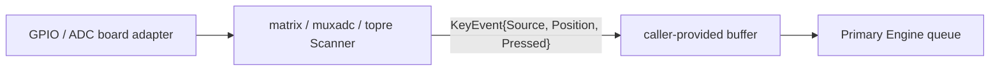

# Issue #1: Scanner abstraction and hardware adapters

## 目的と完了状態

- Issue: [#1 Scanner abstraction and hardware adapters](https://github.com/tgk-project/tgk/issues/1)
- 完了した範囲: `KeyEvent` を発行する Matrix、MUX/ADC、Topre scanner と、共通の time-based debounce を追加した。すべて caller-provided buffer を使い、keycode を生成しない。
- 未完了の完了条件: reference board が Epic #7 で未決定のため、特定ボードの GPIO/ADC adapter と TinyGo firmware build は実装・検証していない。従って Issue #1 全体は完了扱いにしない。
- 対象外: keymap 解決、Split BLE transport、keyboard 固有の配線設定。`old/` 配下の実装は参照していない。

## 設計と実装

`keyboard/event.Scanner`（#8 で定義済み）の `Scan(now, dst)` を全 scanner の共通境界とした。`dst` は呼出側が所有し、scanner は `dst[:0]` に append して返す。容量を超える場合は transition を commit せず error を返すため、次回の Scan で event を再試行できる。

| パッケージ | 実装した責務 |
| --- | --- |
| `scanner/debounce` | debounce candidate と安定状態を保持する allocation-free state。event を buffer へ書けた時だけ stable state を commit する。 |
| `scanner/matrix` | `OutputPin` / `InputPin` adapter 経由で digital matrix を走査する。row-major または明示 `Positions` mapping を使う。 |
| `scanner/muxadc` | `Multiplexer` / `RowDriver` / `ADC` adapter 経由で行列状の analogue sensor を走査する。press/release threshold による hysteresis を持つ。 |
| `scanner/topre` | `Reader` adapter 経由で Topre-style sensor を走査する。sensor index は `Positions` で物理 Position へ変換する。 |

各 scanner は `Source` と `Position`、`Pressed`、`Timestamp` だけを `event.KeyEvent` に入れる。Binding、keycode、layer、modifier、Host report は `keyboard/engine` に残るため、Primary-only state ownership と Position-to-keycode separation を維持する。

`matrix` は行を active にして列を読むための抽象 GPIO interface だけを知る。`muxadc` と `topre` は press threshold と release threshold を分け、threshold 間の値では直前の debounced state を維持する。すべての pin/ADC/board wiring は adapter の実装側に閉じ込め、scanner package と keyboard core は `machine` を import しない。

## 判断理由

- hardware package を直接 import すると通常 Go test と新しいボードへの移植が難しくなるため、最小の GPIO/ADC interface を scanner 側の境界にした。
- buffer が満杯のときに debounced state だけ進めると press/release の対応が失われるため、event を append できた場合だけ `debounce.State.Commit` を呼ぶ。
- analogue scanner は単一 threshold では電圧揺れで連続 transition を起こし得るため、press/release の 2 threshold と debounce を両方適用した。
- `Source` は scanner config で固定し、同一 Position 番号を使う複数の物理 input が Engine で区別できるようにした。

## 検証

以下は `mise` で固定した Go `1.27.0` による Host-side 検証である。GPIO、ADC、reference board、TinyGo firmware の実機検証ではない。

| コマンド | 結果 |
| --- | --- |
| `mise exec go -- go test ./...` | 成功。#8 の fake scanner 経由の core 消費テストと、各 scanner の host-side test を実行した。 |
| `mise exec go -- go test -run 'Test(MatrixDebounceAndPositionMapping|MUXADCDebounceHysteresisAndPositionMapping|TopreDebounceHysteresisAndPositionMapping)$' ./scanner/... -count=1` | 成功。3 scanner の debounce/hysteresis と Position mapping を再確認した。 |
| `mise exec go -- go test ./scanner/matrix -count=1` | 成功。buffer が満杯でも transition を次回 scan に保持すること、および Matrix の event path が allocation 0 であることを確認した。 |
| `mise exec go -- go test -race ./...` | 成功。Host-side race 検査。 |
| `mise exec go -- go vet ./...` | 成功。 |

## 制約と次の依存関係

- Epic #7 では reference board（XIAO BLE、Feather nRF52840 Express、または別 board）が未決定である。この決定なしに GPIO pin、MUX selector、ADC channel の実装・build target を選ぶことはできない。
- reference board が決まったら、board package で `matrix.OutputPin` / `matrix.InputPin`、または `muxadc` / `topre` の adapter を実装し、TinyGo build と実機 Position event を検証する。この部分を終えるまで #1 を close しない。
- #12/#13 の Split 実装は scanner event を transport へ渡すが、keycode や layer state を Secondary に追加してはならない。
- #8 の `Engine.PollScanner` は同じ `event.Scanner` を consumer として受け取るため、reference adapter は追加の core API を必要としない。
