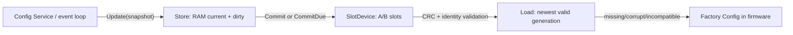

# Issue #10: Configuration schema and crash-safe persistence

## 目的と完了状態

- Issue: [#10 Configuration schema and crash-safe persistence](https://github.com/tgk-project/tgk/issues/10)
- 完了状態: `keyboard/config/storage` に、Factory Config から独立した User Config の A/B slot 永続化を実装した。RAM への即時反映、明示 commit / debounce commit、CRC による検証、破損時の復旧、および `Magic`/schema/layout 不一致時に明示 Factory Reset まで commit を拒否する保護を実装した。host-side suite と XIAO BLE firmware build で検証した。
- 対象: 固定長 `Header`、little-endian codec、CRC32、世代番号、二つの erase slot、Factory Config への fallback、TinyGo `machine.Flash` と接続できる Flash adapter。
- 対象外: VIA/RAW HID command、UI、BLE bond の保存・削除、実際の reference keyboard の Flash block 割り当て、実機での電源断試験。bond reset は User Config reset と明示的に別の責務にした。

## 設計と実装

`keyboard/config/storage` は board、GPIO、BLE、USB、`machine` を import しない。`SlotDevice` が二つの独立 erase slot を表し、`MemoryDevice` は host-side test 用、`FlashSlots` は TinyGo の `machine.BlockDevice` を接続する adapter である。`platform/xiao_ble.NewConfigSlots` が nRF52840 の `machine.Flash` をこの adapter へ接続する。どの Flash erase block を予約するかは keyboard/board composition が `firstEraseBlock` として渡すため、core が board の Flash layout を決めない。

保存形式は 24 byte の header と 10 byte ごとの `keymap.Binding` payload である。header は `Magic`、`SchemaVersion`、`LayoutID`、`Generation`、`PayloadLength`、`CRC32` を含む。CRC は CRC field を除く header と payload に対して算出する。header の reserved byte は常に 0 とし、0 以外は破損として拒否する。Binding は既存の固定 `BehaviorID` と数値 parameter のまま保存するため、Go pointer や実装型名を保存しない。復元時と `Update` 時は `keymap.ValidateBinding` で未知 Behavior と不正 parameter を拒否する（Layer target の範囲は layer 数を持つ `keymap.New` が検証する）。

`Store.Update` は RAM の configuration を直ちに差し替えて dirty にするだけで I/O をしない。`CommitDue` は `DebounceTicks` 経過後だけ `Commit` を呼び、`Save` は ConfigStore interface 向けの明示的・同期的 commit とした。keyboard の scan/BLE/USB callback は `Update` までに留め、Flash I/O は Primary の event loop 側で実行する設計である。

`Commit` は現在有効な slot と反対側を erase し、新しい generation を書込み後に read-back / CRC 検証する。書込みが電源断などで途中までしか完了しなければ、その slot は次回 `Load` で無効になり、前の正常 slot を選ぶ。両 slot が無効なら Factory Config を選ぶ。`SchemaVersion`、`LayoutID`、または Magic が違う CRC 正常データは User Config として採用せず、`MigrationRequired` を立てる。この状態の `Commit`/`Save` は `ErrMigrationRequired` を返すため、firmware 更新は既存の有効データを暗黙に上書きできない。呼び出し側は将来の migration か、明示的な `Reset` を選ぶ。

## 判断理由

- copy-on-write 相当の A/B slot を選んだ。単一 slot の erase/write では、電源断時に正常な User Config を失うためである。
- Factory Config は slot に書戻さない。User Config の破損や非互換から常に recover でき、Factory Reset は User keymap のみを erase する。
- schema/layout 不一致に migration を推測適用しない。migration の変換規則がまだ存在しないため、この実装では `ErrMigrationRequired` と Factory Reset を安全な明示回復手段とした。Factory Config を RAM へ fallback するだけでは、続く保存で旧 slot を消せてしまうため、commit 自体を拒否する。
- Factory Config も slot に収まることを `New` 時に検証する。User Config と復旧先のサイズ条件を分けず、起動後に保存不能な Factory Config を抱えないためである。
- `FlashSlots` は `machine.Flash` を直接 import せず `FlashDevice` を受け取る。Storage core の transport/hardware 非依存性を保ちつつ、TinyGo nRF52840 の block device API を利用できる。
- storage にも Binding の基本検証を置いた。CRC が一致するデータでも、無効な key usage などを Primary の keymap engine へ渡さないためである。layer 数を保存形式へ重複させず、layer index の整合性は既存の `keymap.New` の責務に保った。
- `KeyEvent`、layer、modifier、Host report は storage に入れない。保存対象は keymap Binding だけであり、Primary-only state ownership と Position-to-keycode separation を維持する。

## 検証

以下は macOS host で `mise` により固定した Go `1.27.0` を使った host-side 検証である。nRF52840 実機、Flash、電源断は実行していない。

| コマンド | 結果 |
| --- | --- |
| `mise exec go -- go test ./keyboard/config/storage -count=1` | 成功。空 slot の Factory fallback、CRC で破損した newest slot から前世代への fallback、`Magic`/schema/layout 不一致、非互換 firmware が既存 slot を保持したまま commit を拒否すること、明示 Reset 後の保存、途中書込み、debounce、User Config reset、不正 Binding と slot に収まらない Factory Config の拒否、Flash block offset を検証した。 |
| `mise exec go -- go test ./keyboard/... -count=1` | 成功。新しい storage package と既存 engine/keymap を含む keyboard package suite。 |
| `mise exec go -- go test -race ./keyboard/... -count=1` | 成功。keyboard package 全体の race 検査。 |
| `mise exec go -- go vet ./keyboard/...` | 成功。 |
| `mise exec go -- go test ./... -count=1` | 成功。storage を含む TGK v2 の全 host-side package suite。 |
| `mise exec go@1.25 -- tinygo build -target=xiao-ble -o /private/tmp/tgk-xiao-ble-issue10.uf2 ./cmd/xiao-ble-scanner` | 成功。`platform/xiao_ble.NewConfigSlots` を含む XIAO BLE firmware の build-only 検証。実機への flash、実電源断からの復旧は実施していない。 |
| `git diff --check` | 成功。追加・変更したファイルに whitespace error なし。 |

## 制約と次の依存関係

- `FlashSlots` は二つの連続 erase block を必要とする。reference keyboard の `firstBlock` と firmware linker/Flash layout は #3 / #14 の board composition で確定し、nRF52840 firmware build・flash・電源断復旧を確認する必要がある。
- 実機への flash、実電源断、Flash erase block 予約が firmware image と衝突しないことは未検証である。XIAO BLE build は通過したが、これらは board composition と hardware-in-the-loop の確認が必要である。
- `Snapshot.Bindings` は既存 #8 contract の flat binding slice を保存する。layer 数や position mapping を含む runtime Config Service と VIA adapter は #11 の責務である。そこで schema migration が必要になれば、明示的 migration を追加する。
- `Commit` は Flash I/O を行うため、callback から直接呼ばない。composition は `Update` と `CommitDue` を Primary event loop の安全な時間帯に接続する必要がある。
- bond の保存・reset はここに含まれない。BLE Host transport (#4) が User Config reset と独立した bond lifecycle を提供する。
