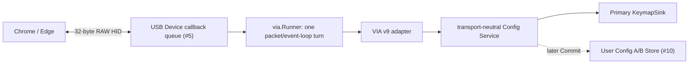

# Issue #11: Runtime config service and VIA RAW HID adapter

## 目的と完了状態

- Issue: [#11 Runtime config service and VIA RAW HID adapter](https://github.com/tgk-project/tgk/issues/11)
- 完了した範囲: transport 非依存の `keyboard/config/service`、VIA protocol v9 の必要な RAW HID keymap command を解釈する `keyboard/config/via`、reference keyboard 用の `keyboards/reference/via.json` を追加した。物理 unlock の期限内だけ destructive write を許可し、変更は Primary-owned keymap に RAM 即時反映した後、event loop が明示 `Commit` するまで永続化を遅延する。
- 対象: protocol version、firmware version、layer count、単一 keycode の read/write、keymap byte buffer の read/write、EEPROM/Factory Reset、1 packet ごとの event-loop runner、malformed packet と未対応 keycode の安全な拒否、reference keyboard の VIA definition JSON。
- 対象外: BLE Configurator、Vial、macro/custom keycode、実機の physical unlock gesture、reference Primary の Flash block 選定、Chrome/Edge と実機 RAW HID の往復、BLE bond の削除。bond lifecycle は User Config reset と分離した。

## 設計と実装

`service.Service` は `ConfigStore`、`KeymapSink`、keyboard definition から渡された identity / layer / position / Factory bindings だけに依存する。VIA command ID、USB endpoint、Flash、GPIO、BLE を import しない。起動時は `ConfigStore.Load` の User Config（または #10 の Factory fallback）を検証し、`KeymapSink.ReplaceKeymap` へ適用する。更新時は flat な layer-major binding を完全な `keymap.Keymap` として検証してから sink と RAM 状態を入替え、`Commit` が `ConfigStore.Save` または `ConfigStore.Reset` を実行する。

`engine.Engine.ReplaceKeymap` は、既に押されているキーを `ReleaseAll` してから同じ layer / position 次元の keymap だけを交換する。これにより、古い binding で押されたキーを新しい binding で release することや stuck key を避ける。Scanner と Secondary が発行する値は引き続き physical position のみであり、layer / modifier / Host report と runtime keymap は Primary にだけ存在する。

`via.Adapter` は official VIA app が使う command ID `0x01`、`0x02` (firmware version)、`0x04`、`0x05`、`0x0a`、`0x11`、`0x12`、`0x13` を扱う。keymap buffer は VIA の big-endian 16-bit keycode を layer-major で扱い、1 response に収まる最大 28 data byte を検証する。通常 HID usage、個別 modifier、MVP の `TO` / `MO` / `TG` は `keymap.Binding` へ変換する。consumer、複数 modifier の同時 binding、Transparent、Vial / macro / custom keycode はこの adapter では未対応として拒否する。

`Unlock(now)` は board composition が物理操作を確認した場合だけ呼ぶ API で、`UnlockTicks` 経過時には `Locked(now)` が自動 relock する。write、bulk write、Factory Reset は lock 中に `service.ErrLocked` を返す。Factory Reset は即座に Factory binding を RAM に戻すが、Flash erase は callback や parser 中に実行せず、後続の `Commit` で `ConfigStore.Reset` を呼ぶ。これは User Config だけを reset し、bond の削除を暗黙に行わない。

`via.Runner` は `keyboard/transport/usb.Device` が満たす小さな RAW byte boundary を受け、preallocate 済みの 32 byte buffer で 1 turn に最大 1 command を処理する。USB callback は既存 #5 の bounded queue への copy のみを行い、config traffic が callback 内で engine や persistence を実行しない。

## 判断理由

- Config Service を VIA adapter の下に置いた。将来 WebSerial や BLE GATT を追加しても、keymap engine、storage、Factory Config が VIA command ID に依存しないためである。
- keymap 書込みは単一 binding でも keymap 全体を検証してから atomic に sink へ渡す。layer target の範囲など、binding 単体では判断できない不整合を Primary engine に渡さないためである。
- 物理 unlock は transport 側の認証で代替しない。USB 接続だけで destructive command を受ける状態にせず、board 固有の安全な操作を composition が実装できるようにした。
- Factory Reset の Flash 操作を command handler から分離した。RAW HID callback はもちろん、config packet を取り出した直後にも erase/write を実行せず、keyboard event loop が安全なタイミングで `Commit` を選べる。
- engine の keymap 交換前に全解放を行う。Primary-only state ownership を維持しつつ、runtime 編集で stale press を残さないためである。
- reference definition は XIAO BLE の 1x1 build probe と一致する `VID 0x1209`、`PID 0x0001`、1 row / 1 column とした。GPIO pin、Flash block、USB endpoint は JSON や core に含めない。

## 検証

以下は macOS host で実行した host-side / build-only 検証である。XIAO BLE 実機、Chrome/Edge、物理 unlock 操作は使用していない。

| コマンド | 結果 | 種別 |
| --- | --- | --- |
| `mise exec go -- go test ./keyboard/config/service ./keyboard/config/via ./keyboard/engine ./keyboards/... -count=1` | 成功。lock / timeout relock、RAM 即時反映、`Commit` 後の再生成での binding 復元、deferred Factory Reset、VIA single/bulk command、event-loop runner の 1 packet 処理、engine の全解放後 keymap 交換、definition JSON を検証した。 | host-side |
| `mise exec go -- go test ./... -count=1` | 成功。TGK v2 の全 host-side package suite が通過した。 | host-side |
| `mise exec go -- go vet ./...` | 成功。 | static check |
| `mise exec go -- go test ./keyboard/config/via -run=^$ -fuzz=FuzzHandleMalformedPackets -fuzztime=3s` | 成功。3 秒で 1,681,792 execution、33 の corpus / interesting input を処理し、panic は発生しなかった。 | host-side fuzz |
| `mise exec go@1.25 -- tinygo build -target=xiao-ble -o /private/tmp/tgk-xiao-ble-usb-issue11.uf2 ./cmd/xiao-ble-usb` | 成功。既存 composite USB HID endpoint を含む XIAO BLE firmware を生成した。 | build-only |
| `git diff --check` | 成功。今回の作業ツリーに whitespace error はない。 | static check |

## 制約と次の依存関係

- `Runner` は USB RAW byte transport と Config Service の接続点を提供するが、reference Primary firmware はまだ Factory Config、Flash slot、engine、physical unlock の board composition を完結していない。#14 がこれらを実際の main loop に接続する必要がある。
- USB descriptor / endpoint の build は確認したが、XIAO BLE への flash、Chrome/Edge が `via.json` を読み込んで keymap を変更すること、変更後の USB HID input、物理 unlock は hardware-in-the-loop で未検証である。したがって Issue #11 の実機 Done 条件を達成済みとは主張しない。
- `Commit` は Flash I/O を行うため、composition は scanner / BLE / USB callback の外で呼び出す必要がある。#10 の A/B persistence により、成功した commit の再起動復元は host-side test で確認したが、実 Flash の電源断復旧は #10 / #14 の実機検証が残る。
- Adapter の current scope は通常 keycode、単独 modifier、MVP layer behavior までである。consumer、複数 modifier、Transparent、Vial、macro、BLE Configurator は対象外のままである。
