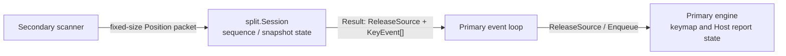

# Issue #12: Split event protocol, resync, and disconnect safety

## 目的と完了状態

- Issue: [#12 Split event protocol, resync, and disconnect safety](https://github.com/tgk-project/tgk/issues/12)
- 完了状態: `keyboard/transport/split` に、Secondary から Primary へ物理 Position event だけを運ぶ versioned fixed-size packet と、packet loss・切断時に安全側へ復帰する接続単位の session state を実装した。`engine.Engine.ReleaseSource` は切断した source だけを解放し、別 source の入力状態は保持する。
- 対象: version、source、sequence、event count、`Position + Pressed` payload、snapshot resync、未知/破損 packet の拒否、sequence gap、Secondary 切断時の stuck key 防止。
- 対象外: BLE GATT service、scan/advertise、Primary の discovery/subscription、Secondary notification の送信である。これらは #13 の責務であり、実機上の dual-role BLE の成立は #9 の結果に依存する。

## 設計と実装

`keyboard/transport/split` は BLE やボード固有 API を import しない。packet は default BLE ATT notification payload に収まる 18 byte 固定長で、先頭 6 byte に version、flags、source、event count、little-endian sequence を置き、残りに最大 4 個の 3 byte event（little-endian position と pressed byte）を置く。未使用領域が非ゼロ、未知 flag/version、長さ不足、event count 不正は `Decode` が拒否する。

version 1 では、通常 packet は少なくとも 1 event を持つ edge 列である。`Snapshot` packet は現在押下中の Position だけを列挙するため、すべて `Pressed=true` とし、空 snapshot は `SnapshotLast` を立てて「押下なし」を表す。4 個を超える押下状態は複数の `Snapshot` packet で送り、最後の packet の `SnapshotLast` が同期完了を表す。互換性を壊す wire format の変更は `Version` を上げ、旧実装は未知 version を解釈せず拒否する。

`Session` は接続開始直後、切断後、sequence gap 後に normal edge packet を受け付けず、`ReleaseSource=true` と `RequestSnapshot=true` を返す。Primary event loop はまず同じ source の queued event を破棄して `Engine.ReleaseSource` を呼び、transport 側に snapshot を要求する。snapshot の処理でも同じ順序で既存 source state を解放してから押下中 Position を enqueue する。これにより失われた key-up による modifier、layer、通常キーの押下残りを防ぐ。

`Engine.ReleaseSource` は `Source + Position` で保持する押下 Binding をその source に限って release する。解放済み source の queue 内 event も除去するため、切断通知より前に queue へ入った古い press が後から適用されない。keymap、layer、modifier、Host report は引き続き Primary だけが所有し、packet や Secondary は keycode を扱わない。

## 判断理由

- transport callback で keymap engine を実行しない v2 境界を守るため、`Session.Process` は event-loop 用の `Result` を返すだけにした。BLE adapter は raw packet を bounded queue へ渡し、Primary loop が `Result` を適用する。
- packet loss を「次の event で推測して継続」すると press/release 対応が壊れるため、gap は必ず source 限定全解放と snapshot 要求にした。
- `Engine.Reset` は Local source を含む全 state を消すため、Secondary 切断には使わない。`ReleaseSource` ならもう片方の分割部や Local scanner が保持する modifier/key を不要に解放しない。
- 将来の拡張を reserved byte の暗黙利用で行うと旧実装が誤解釈するため、未使用 byte はゼロに限定し、wire-level の非互換変更を明示的な version update にした。

## 検証

以下は macOS host 上で `mise` により固定した Go toolchain を使う Host-side 検証である。BLE 実機、packet loss の無線上の観測、再接続、HIL は実施していない。

| コマンド | 結果 | 種別 |
| --- | --- | --- |
| `mise exec go -- go test ./keyboard/engine ./keyboard/transport/split` | 成功。packet encode/decode、malformed input 拒否、snapshot 必須、sequence gap、disconnect、source 限定 release を検証。 | Host-side |
| `mise exec go -- go test ./...` | 成功。既存 scanner/config/USB/core を含む全 Go package の回帰確認。 | Host-side |
| `mise exec go -- go test -race ./keyboard/engine ./keyboard/transport/split` | 成功。queue lock を含む対象 package の race 検査。 | Host-side |
| `mise exec go -- go vet ./keyboard/engine ./keyboard/transport/split` | 成功。 | Host-side |

## 制約と次の依存関係

- `split.Session` は protocol state のみである。#13 はこれを Secondary の GATT notification と Primary の discovery/subscription に接続し、`RequestSnapshot` を実際の再同期要求・応答へ写像する必要がある。
- `Engine.ReleaseSource` は Primary event loop から呼ぶ API である。callback から直接呼ばないことは #13 の実装でも守る必要がある。
- Source ID の割当、Secondary 固有 service UUID、connection handle の lifecycle は #13 で決める。packet codec に device identifier や pairing secret は保存しない。
- nRF52840/S140 上の dual-role 同時接続、独立 disconnect/reconnect、実際の packet-loss/resync は未検証であり、#9/#13 の実機証拠が必要である。
