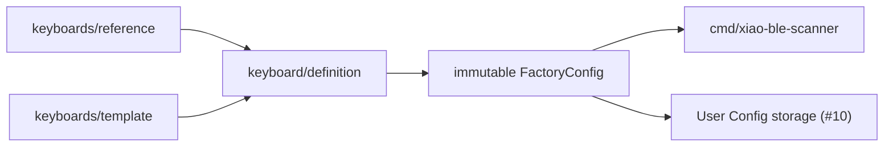

# Issue #3: TGK core とキーボード定義の分離

## 目的と完了状態

- Issue: [#3 Separate TGK core from keyboard definitions](https://github.com/tgk-project/tgk/issues/3)
- 完了状態: `keyboard/definition` を keyboard package と TGK core の公開 composition boundary として追加した。`keyboards/reference` は XIAO BLE の最小 reference keyboard を、`keyboards/template` は別の二位置 keyboard を、core を変更せずに同じ boundary から構成する。
- 対象: immutable Factory Config、VID/PID・product name・`LayoutID`、物理 Position mapping、default keymap、および XIAO BLE build entry からの reference definition 利用。
- 対象外: runtime User Config の保存・migration、RAW HID/VIA、USB/BLE Host transport、実際の多キー board wiring、Flash erase block の割り当て。これらは #10、#11、#4、#5、#14 で扱う。

## 設計と実装

`keyboard/definition.Definition` は keyboard package が提供する値であり、`Identity`、keymap の dense index から scanner の物理 `Position` への mapping、Factory layer table を持つ。`definition.New` は以下を検証して copy する。

- `VendorID`、`ProductID`、`LayoutID` と product name の存在
- Position 数が keymap の position 数と一致すること、および Position の重複がないこと
- 既存 `keymap.New` による Behavior ID、parameter、layer target の検証

返る `FactoryConfig` は未公開 field に保持し、`Positions` と `Bindings` は copy を返す。Factory keymap は runtime User Config と独立して firmware 側に残り、`LayoutID` は将来の User Config storage が layout の不一致を検出するために利用できる。`Bindings` は layer-major の固定 `BehaviorID` と数値 parameter であり、Go pointer や実装型名を含まない。

`keyboards/reference` は現在の一キー XIAO BLE build probe の identity、default binding、Position map を所有する。`cmd/xiao-ble-scanner` は board pin と `platform/xiao_ble.NewMatrix` の adapter を composition として保持する一方、Position map を reference の `FactoryConfig` から受け取る。GPIO、ADC、BLE、USB、Flash、board package を `keyboard/definition` と `keyboards/*` は import しない。

`keyboards/template` は二位置の別 keyboard package である。`keyboards/keyboards_test.go` は reference/template を同じ public API で構成し、別 `LayoutID` と各 Position map を確認する。keyboard 固有の identity、layout、factory keymap を core package に追加せず、別 package の追加をテスト可能にした。

## 判断理由

- keyboard package が `FactoryConfig` を構成し、core は `keymap.Keymap` と scanner が発行する Position だけを扱うようにした。これにより scanner/Secondary は keycode を持たず、layer・modifier・report は Primary の keymap engine が一貫して所有する。
- Factory Config を mutable User Config store に混ぜなかった。破損または `LayoutID` 非互換の User Config から recovery する際にも、firmware 内の default keymap と physical mapping を復元できるためである。
- board pin は `cmd/xiao-ble-scanner` の firmware composition に残した。core に board wiring を持ち込まず、platform adapter を選択する責務を keyboard/firmware 側に置くためである。
- 外部 keyboard の例は実機用の board package を増やさない `keyboards/template` とした。実機未確認の pin 定義を追加せずに、「第二の keyboard package が core 変更なしで成立する」境界を host-side test で示せるためである。

## 検証

以下は macOS host 上で `mise` が固定する Go を使用した結果である。XIAO BLE 実機への flash や入力試験は実施していない。

| コマンド | 結果 | 証拠の種類 |
| --- | --- | --- |
| `mise exec go -- go test ./keyboard/definition ./keyboards -count=1` | 成功。Factory Config の copy/immutability、identity/Position validation、reference と template の独立 composition を確認。 | host-side |
| `mise exec go -- go test ./... -count=1` | 成功。既存 core、scanner、storage を含む全 host-side suite が通過。 | host-side |
| `mise exec go@1.25 -- tinygo build -target=xiao-ble -o /private/tmp/tgk-xiao-ble-issue3.uf2 ./cmd/xiao-ble-scanner` | 成功。XIAO BLE build entry が `keyboards/reference.FactoryConfig` を利用することを確認。 | build-only |
| `git diff --check` | 成功。追加・変更差分に whitespace error はない。 | static |

## 制約と次の依存関係

- XIAO BLE reference は現在一キーの build probe であり、実際の reference keyboard の pin map、physical layout、Flash region は #14 の firmware composition で確定する必要がある。
- Factory Config は `Bindings` と `LayoutID` を公開するが、User Config を Factory Config から起動時に組み立てる service はまだ接続していない。#10 storage と #11 runtime config service がその責務を持つ。
- TinyGo build は build-only 証拠である。firmware の flash、physical scan、Factory/User Config recovery、USB/BLE input は hardware-in-the-loop で未確認である。
