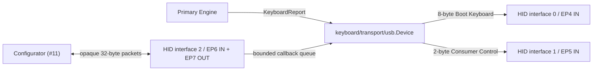

# Issue #5: USB composite HID host transport

## 目的と完了状態

- Issue: [#5 USB composite HID host transport](https://github.com/tgk-project/tgk/issues/5)
- 完了した範囲: `keyboard/transport/usb` に `HostTransport` 実装を追加し、XIAO BLE 向けに Boot Keyboard、Consumer Control、vendor-defined RAW HID を別 HID interface / endpoint として構成した。RAW HID は byte transport のみであり、VIA command の解釈は含まない。
- 対象: `KeyboardReport` の HID packet 化、全解放 packet、固定長 32 byte の RAW HID 入出力、callback からの bounded queue への退避、TinyGo 0.39.0 の USB endpoint API を使う XIAO BLE adapter、firmware build probe。
- 対象外: VIA command semantics と keymap 更新（#11）、User Config 永続化、USB 実機での enumeration / HID 入力、BLE HID。Factory Config やキーボード定義の変更も本 Issue では行っていない。

## 設計と実装

`keyboard/transport/usb.Device` は `keyboard/transport.HostTransport` を実装する。core は `Endpoint` という小さな境界だけを知り、`machine`、USB descriptor、ボード固有 endpoint 番号は `platform/xiao_ble` に閉じ込めた。

| 箇所 | 実装した責務 |
| --- | --- |
| `keyboard/transport/usb` | 8 byte の Boot Keyboard report、2 byte の Consumer Control report、`ReleaseAll`、32 byte RAW HID の送受信と overflow count。RAW callback は copy と固定長 queue への追加だけを行う。 |
| `platform/xiao_ble/usb_hid.go` | TinyGo `machine.ConfigureUSBEndpoint` を所有し、3 HID interface と 4 本の interrupt endpoint を登録する。`machine` callback 用の寿命は package-level `usbHID` が保持する。 |
| `cmd/xiao-ble-usb` | XIAO BLE target で composite descriptor を含む firmware を build する最小 probe。 |

Keyboard、Consumer、RAW を endpoint 単位で分けたため、config packet が keyboard input report として送られることはない。RAW interface は report ID を使わない独立 interface とし、入出力とも固定 32 byte とした。`SendRaw` と `HandleRawOutput` は command の意味を判定せず、#11 の Primary-owned config service が `ReceiveRaw` を event loop 側で消費する前提である。

`ReleaseAll` は keyboard と consumer の両方にゼロ report を送る。これにより、engine の overflow、split disconnect、Host reset の復旧経路で modifier、通常キー、consumer usage を Host に残さない。

## 判断理由

- TinyGo 0.39.0 の `machine/usb/hid/keyboard` は初期化時に共有 HID descriptor / endpoint を設定する。その後に独立 RAW HID interface を安全に追加できないため、標準 keyboard port は利用しなかった。
- `machine.ConfigureUSBEndpoint` は package-level callback 関数を要求する。ローカル adapter の寿命や interface 値を callback に渡さず、`platform/xiao_ble` が configured `Device` を所有する形にした。
- core から `machine` を参照させると Host-side test と transport 置換を妨げるため、packet endpoint の interface に限定した。これにより USB は HostTransport の一実装に留まり、Primary が report state を唯一所有する v2 の境界を維持する。
- RAW HID callback で keymap、config、Flash を実行しない。容量超過時は packet を捨てて count を記録するため、callback は bounded で、破損・過大 packet は queue に入らない。
- Consumer Control は keyboard と別 HID interface にした。Boot Keyboard report の 8 byte 形式を保ちつつ、core が既に生成する consumer usage を Host へ送れるためである。

## 検証

以下は macOS host 上の Host-side / build-only 検証であり、USB cable を接続した enumeration や実機 HID 入力の証拠ではない。

| コマンド | 結果 | 種別 |
| --- | --- | --- |
| `/Users/daiki/.local/share/mise/installs/go/1.27.0/bin/go test ./keyboard/transport/usb -count=1` | 成功。keyboard / consumer の独立 packet、RAW の独立性、bounded callback queue、malformed packet 拒否、`ReleaseAll` を検証した。 | host-side |
| `/Users/daiki/.local/share/mise/installs/go/1.27.0/bin/go test ./... -count=1` | 成功。既存 core、scanner、設定、keyboard definition を含む全 Host-side suite が通過した。 | host-side |
| `/Users/daiki/.local/share/mise/installs/go/1.27.0/bin/go vet ./...` | 成功。 | host-side static check |
| `tgk_go_path=/Users/daiki/.local/share/mise/installs/go/1.25.14/bin; PATH="$tgk_go_path:$PATH" tinygo build -target=xiao-ble -o /private/tmp/tgk-xiao-ble-usb.uf2 ./cmd/xiao-ble-usb` | 成功。TinyGo 0.39.0 と XIAO BLE target で composite HID firmware を生成した。 | build-only |

## 制約と次の依存関係

- XIAO BLE 実機への flash、macOS での keyboard / consumer / vendor HID の enumeration、Chrome/Edge からの RAW HID 往復は未検証である。Issue #5 の「reference Primary が enumerate する」完了条件には HIL が必要である。
- RAW HID queue の overflow は観測可能だが、再送、command response、config write lock、Factory Reset は実装していない。#11 が `ReceiveRaw` を消費し、parser と Dynamic Config Service を追加する。
- descriptor は TinyGo 0.39.0 の `machine.ConfigureUSBEndpoint`、nRF52840 の endpoint 4–7、および Go 1.25.x で build した。TinyGo 更新時は descriptor / endpoint API と target build を再確認する。
- USB Host disconnect の実機通知・状態管理は未実装である。現時点で engine の `Reset` / `ReleaseAll` は明示的な安全復旧経路として使用できるが、bus event からの接続 lifecycle は後続の board integration で検証する必要がある。
