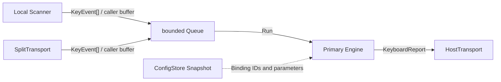

# Issue #8: Core event loop, keymap engine, and MVP behaviors

## 目的と完了状態

- Issue: [#8 Core event loop, keymap engine, and MVP behaviors](https://github.com/tgk-project/tgk/issues/8)
- 完了状態: Primary が所有する、ハードウェア非依存のイベント処理・キーマップ解決・Host report 生成を実装した。標準 Go の Host-side テストで検証済みである。
- 対象: source-aware な物理 Position event、固定長 event queue、position-to-binding 解決、`Key` / `Modifier` / `Consumer` / `Transparent` / `None` / `MO` / `TO` / `TG`、および設定・Host・Split の境界型。
- 対象外: GPIO/ADC を使う scanner、USB/BLE の実装、Flash への永続化、VIA RAW HID、実機ビルドと HIL 検証。これらはそれぞれ後続 Issue の責務とした。

## 設計と実装

主要な実装は `keyboard/` 配下に限定した。ここには `machine`、BLE、USB、Flash、ボード固有パッケージへの import はない。

| パッケージ | 実装した責務 |
| --- | --- |
| `keyboard/event` | `KeyEvent`（`Source`、`Position`、`Pressed`、`Sequence`、`Timestamp`）と、呼出側 buffer を受け取る `Scanner.Scan` |
| `keyboard/keymap` | 永続化可能な `BehaviorID` と `Binding`、不正な layer/parameter を拒否する immutable `Keymap` |
| `keyboard/engine` | bounded ring buffer、Primary 所有の押下・layer・modifier・consumer state、report 生成と安全 reset |
| `keyboard/report` | transport 非依存の `KeyboardReport` と 6KRO 超過時の `ErrorRollOver` |
| `keyboard/transport` | `HostTransport` と、Position event のみを運ぶ `SplitTransport` |
| `keyboard/config` | `ConfigStore`、`Header`、`Snapshot` の境界。Flash 実装は含めない |

`KeyEvent.Position` は keycode ではない。`engine.Engine` が active layer から Binding を解決し、`Source + Position` ごとに解決済み Binding を保持する。このため、キーを押してから layer が変わっても、解放時には押下時と同じ Binding を安全に解除する。Keymap、modifier、layer、Host report は Primary の `Engine` だけが保持し、Scanner と Secondary 側は物理 Position を発行するだけである。

`Enqueue` は queue への追加だけを行う。queue が満杯になると overflow 回数を記録し、次の `Run` が未対応 event を破棄して state をゼロ化し、`HostTransport.ReleaseAll` を呼ぶ。これにより欠落した release event による stuck key を残さない。`Options.MaxPressed` と queue capacity は生成時に確保するため、通常の press/release path は追加 allocation を必要としない。

Host report は modifier と最大 6 個の keyboard usage を持つ。7 個以上の異なる通常キーが押されている間は全 slot に HID `ErrorRollOver` を出し、6 個以下に戻ると押下状態から report を再構成する。

## 判断理由

- Behavior は interface 実装や Go pointer ではなく、固定の `BehaviorID` と 2 個の数値 parameter とした。将来 `ConfigStore` が保存しても実装名・アドレスに依存しない。
- scanner と Split 入力を同じ `KeyEvent` と queue に集約した。これにより通信方式によらず同一の keymap state machine を通る。
- queue overflow で古い event を処理し続けると press/release の対応が壊れるため、復旧時は report/state を全解放する。Split の sequence gap 検出と snapshot resync は #12 の責務として残した。
- `TO` は base layer を移動し、既存の toggle/momentary layer state を解除する。`MO` の後続 release は count が 0 の場合に無害に扱う。
- 6KRO を超えた入力を黙って欠落させないため、HID の `ErrorRollOver` を明示する。NKRO report 形式そのものはこの Issue の対象外である。

## 検証

以下は macOS host 上で `mise` により固定した Go `1.27.0` を使った Host-side 検証である。実機や firmware build の証拠ではない。

| コマンド | 結果 |
| --- | --- |
| `mise exec go -- go test ./...` | 成功。keymap validation、MVP behavior、scanner/split 同一解決、source 分離、overflow release、6KRO 復帰、無 allocation path を検証した。 |
| `mise exec go -- go test -run 'Test(EventPathDoesNotAllocate|SixKeyReportRecoversAfterRollover|OverflowReleasesStateAndDropsUnmatchedEvents)$' ./keyboard/engine -count=1` | 成功。hot path allocation、rollover 復帰、event loss 時の全解放を再確認した。 |
| `mise exec go -- go test -race ./...` | 成功。複数の callback producer が `Enqueue` のみを並行実行するケースを含む Host-side race 検査。 |
| `mise exec go -- go vet ./...` | 成功。 |

## 制約と次の依存関係

- scanner の GPIO/ADC debounce と Position mapping は未実装である。#1 は `event.Scanner` を実装し、この Engine に caller-provided buffer で event を渡せる。
- Split packet の sequence、resync、disconnect event 注入は未実装である。#12/#13 は `transport.SplitTransport` を実装し、切断時に `Engine.Reset` または同等の全解放を呼ぶ必要がある。
- `ConfigStore` は interface のみで、A/B slot、CRC、migration、Factory Config 復旧は #10 の責務である。
- `HostTransport` は interface のみで、USB HID、BLE HID、bond lifecycle、Host 再接続は未検証である（#5、#4）。
- `sync.Mutex` を使う bounded queue は標準 Go の race 検査まで確認した。TinyGo/nRF52840 firmware build と実機割込み callback からの動作は未検証である。
