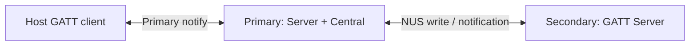

# Issue #9: dual-role BLE feasibility spike

## 目的と完了状態

- Issue: [#9 Validate dual-role BLE on nRF52840/S140](https://github.com/tgk-project/tgk/issues/9)
- 完了した範囲: XIAO BLE（nRF52840 / S140 v7）上で、Primary が Host 側 GATT Server と Secondary 側 GATT Client を並行させるための、再現可能な二台構成の Spike を追加した。依存する `tinygo.org/x/bluetooth` は `81dadabd0578e13280d0a58c8cdeac35e63d5b08` に固定した。
- 未完了: 二台の実機、Host GATT client、電源再投入を使う HIL 実行、接続 handle ごとの server/client/security routing の実測、レイテンシ p50/p95、および go/no-go 判定。これらを行っていないため、完全無線分割の feasibility はまだ未確定である。
- 対象外: production BLE HID、split packet protocol、keyboard engine への接続、bond lifecycle の製品実装。

## 設計と実装

`cmd/xiao-ble-dual-role-secondary` は Secondary 用である。Nordic UART Service を advertising し、Primary からの write を受け、1 秒ごとの notification を送る。

`cmd/xiao-ble-dual-role-spike` は Primary 用である。独自の notify-only GATT service を advertising して Host 側 central に 1 秒ごとの heartbeat を送り、並行 goroutine で Secondary を scan、connect、service/characteristic discover、notification subscribe し、Secondary へ write を送る。HID report や key event は意図的に含めず、BLE role と GATT notification の切り分けに専念する。

この Spike は keycode を扱わず、`keyboard/` core を import しない。したがって Position-to-keycode separation と Primary-only keymap state ownership を崩さない。接続 callback と notification callback もログ出力だけに留め、engine や永続化処理を callback 内で実行しない。

## 判断理由

- XIAO BLE target は TinyGo 0.39.0 で `nrf52840`、`softdevice`、`s140v7` build tag を持つため、#9 の S140 条件を満たす board target として使用した。
- 依存はタグではなくコミット SHA を Go pseudo-version `v0.15.1-0.20260825095354-81dadabd0578` として固定した。以降の再現実験で Bluetooth API の変化を混ぜないためである。
- `tinygo.org/x/bluetooth` の現行開発ブランチには S140 用の Central/Peripheral 接続イベントと GATTC event 分岐がある。一方、GATT Server の `Characteristic.Write` と disconnect cleanup に単一 `currentConnection` を使う実装が残る。このため二接続時の送信先・切断独立性を build 成功だけで保証できない。HIL の各試験では Primary notification が Secondary の接続・切断後も Host へ届くことを必ず確認する。

## 検証

以下は build-only / source inspection の証拠であり、実機結果ではない。実行後に結果欄を更新する。

| 手順 | コマンドまたは操作 | 現在の結果 |
| --- | --- | --- |
| Primary firmware build | `mise exec go@1.25 -- tinygo build -target=xiao-ble -o /private/tmp/tgk-xiao-ble-dual-role-primary.uf2 ./cmd/xiao-ble-dual-role-spike` | 成功（build-only） |
| Secondary firmware build | `mise exec go@1.25 -- tinygo build -target=xiao-ble -o /private/tmp/tgk-xiao-ble-dual-role-secondary.uf2 ./cmd/xiao-ble-dual-role-secondary` | 成功（build-only） |
| Host-side regression | `mise exec go@1.25 -- go test ./...` | 成功。既存 core/scanner/config/USB の tests を含む。 |
| Host と Secondary の同時接続 | Primary と Secondary を flash し、Host GATT client で `TGK-Primary-Spike` の notify を subscribe する | 未実行（HIL） |
| Secondary reconnect | Secondary を再起動し、Primary が再 scan/connect した後も Host heartbeat と Secondary notification が続くことを serial log で確認する | 未実行（HIL） |
| Power-cycle recovery | Primary を再起動し、Host/Secondary の両方が復帰することを確認する | 未実行（HIL） |
| レイテンシ | Secondary notification に送信 tick を載せ、Host-side log で少なくとも 100 sample の p50/p95 を記録する | 未実行（HIL） |

## 制約と次の依存関係

- 現在の Primary は Secondary 接続後に一度だけ scan する。reconnect state machine は #13 の Split BLE transport で実装する。
- `tinygo.org/x/bluetooth` の単一 `currentConnection` は、Primary が Host と Secondary を同時接続する要件に対する未解決リスクである。HIL で再現した場合の最小 upstream/fork 方針は、connection handle ごとに GATTS notification target、disconnect cleanup、GATTC notification callback、security/bond state を保持することである。TGK 側で global state を回避する wrapper を作って隠蔽しない。
- Host GATT client は GATT server 接続の確認専用であり、BLE HID の pairing/bonding 互換性は #4 の責務である。
- HIL の go/no-go は、Host notification と Secondary notification が双方向で 100 回以上連続し、各接続を個別に切断・再接続してももう一方が維持され、Primary power cycle 後にも再接続できた場合にのみ決定する。レイテンシ p50/p95 はこのログから測定して記録する。
